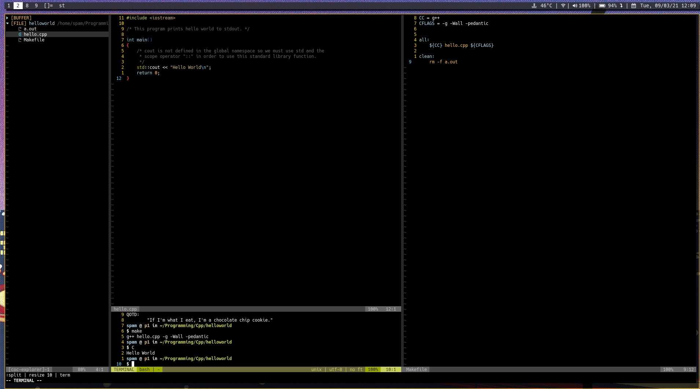

# A1:T1: Hello World

## Programming Languages and Paradigms Seminar

### Running the program

Navigate to the directory and run the `make` command. This will produce a
binary executable for you to run like `./hello`.  

### Deleting the program  

You may use the `make clean` command to delete the produced binary.  

### Screenshot  

