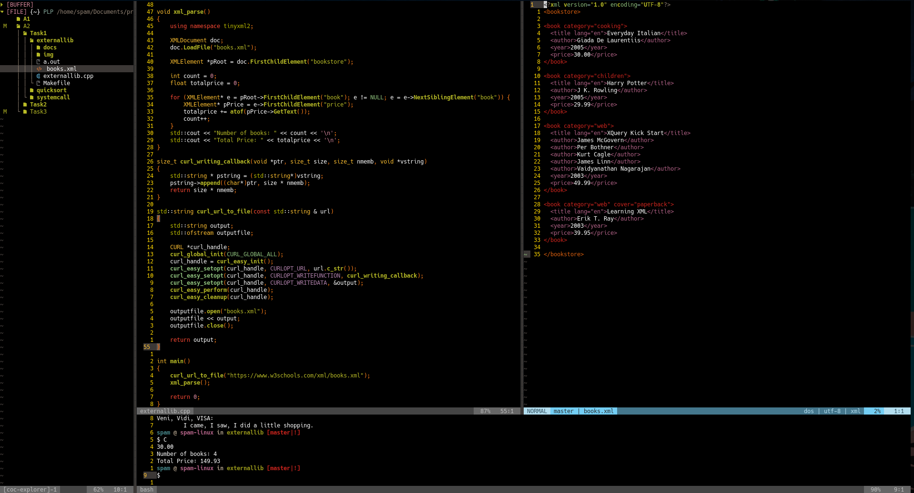

# A2:T1: External lib

## Programming Languages and Paradigms Seminar

### Approach

This program uses `libcurl` to download the contents of the url and write them
to a an XML file using `std::ofstream`. The second library is `tinyxml2` which
is used to identify the "root" element and it's child the `book` element. Then
a for loop is ran on the returned pointer to iterate between sibling books.
Every iteration is used to increment a counter for the number of books. During
each iteration the child element `price` is also accesed, read, converted to a
float with `atof` and added to a running count under the variable `totalprice`.

### Running the program

Navigate to the directory and run the `make` command. This will produce a
binary executable for you to run like `./a.out`.  

### Deleting the program  

You may use the `make clean` command to delete the produced binary.  

### Screenshot

