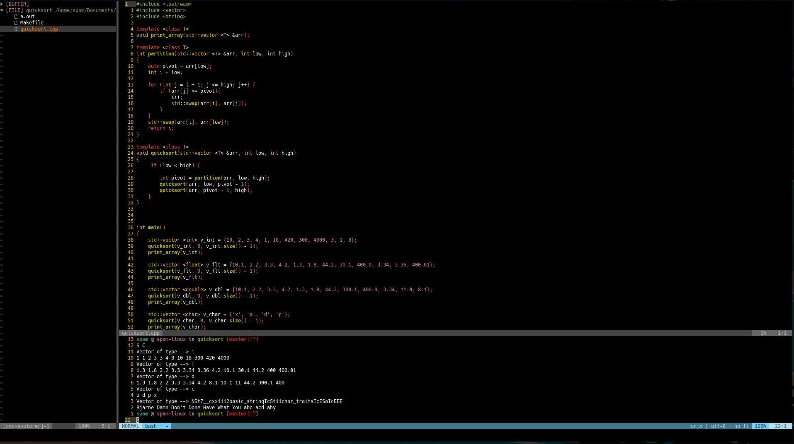

# A2:T1: Generic quicksort

## Programming Languages and Paradigms Seminar

### Approach
This program uses c++ templates in order to achieve the generic type behaviour. The implementation of the quicksort is a classic lomuto partitioning. The partition function receives vectors of generic types and uses the `auto` feature of c++ in order to initialise the value of the pivot. This is crucial in order to keep type compatibility.

### Running the program

Navigate to the directory and run the `make` command. This will produce a
binary executable for you to run like `./a.out`.

### Deleting the program

You may use the `make clean` command to delete the produced binary.

### Screenshot

