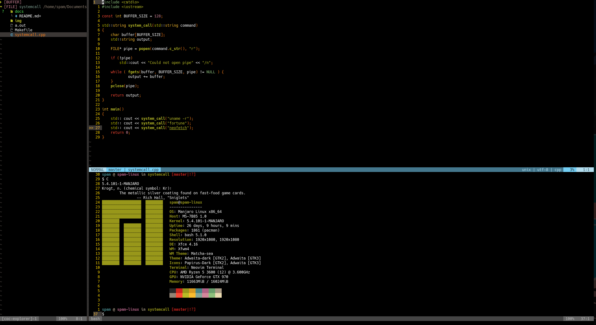

# A2:T1: System Call

## Programming Languages and Paradigms Seminar

### Approach
This implementation utilises a `FILE` object and system pipe (`popen`) in order to store the output from `stdout` to the `FILE` object and then print it out back again to `stdout` with `cout`. This approach is necessary as the built in `system()` c++ STL function returns only the exit code of the system call and not the output thus it is necessary to capture all the output of the pipe to a buffer and then print it to the console. This implementation runs three commands.

First it prints the kernel version, then output as random `fortune` and finally gives a system overview using the notorious `neofetch` tool.

### Running the program

Navigate to the directory and run the `make` command. This will produce a
binary executable for you to run like `./a.out`.

### Deleting the program

You may use the `make clean` command to delete the produced binary.

### Screenshot

