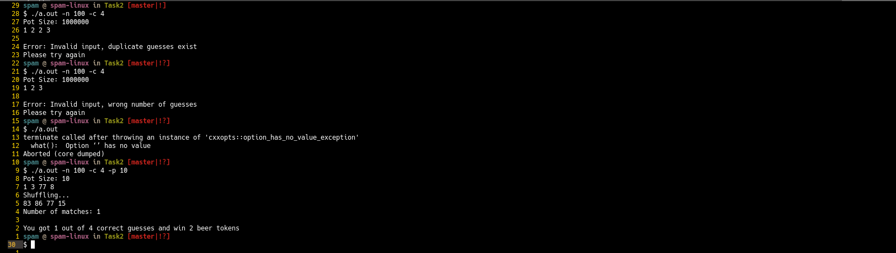

# A2:T2: lottery

## Programming Languages and Paradigms Seminar

### Approach
I utilised the `cxxoptsx.hpp` header only library based on it's popularity in my research. `Boost` is an option but not recommended unless the program already has a `Boost` dependency. The error handling and default values are quite nice with `cxxopts` but I did steal some stuff from my `fizzbuzz++` in order to meet all the input validation conditions. One important thing I reused was the `stringstream` operation which allows for white space tolerance in the input. I am also very proud of the loading animation I created using text and the `sleep()` function. I use vectors for storing the input and the generated psuedo random numbers. I also sort the vectors and use `adjacent_find` from the `STL` in order to ensure uniqueness in the values. The correct matches are computed using the `set_intersection()` function. I did a lot of research on the various approaches and this seemed the most elegant and interesting. I also faced the ever present float conversion rounding issues and used the well known `+ 0.5` work around and created an if statement to handle the case of zero matches. All the input validation works and the cli args parsing seems very robust. I am happy I didn't have to spend the whole day debugging a self written `get_opts()` implementation and highly recommend this library for `GNU` compatible cli arguments. This program will likely not run on Windows due to the use of the `sleep()` system call.

### Running the program

Navigate to the directory and run the `make` command. This will produce a
binary executable for you to run like `./a.out`.

### Deleting the program

You may use the `make clean` command to delete the produced binary.

### Screenshot

