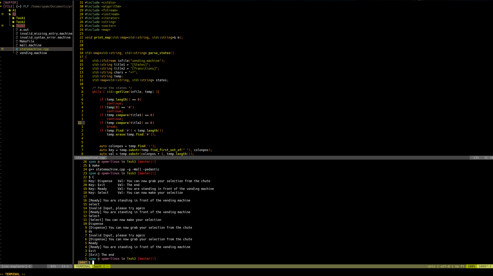

# A2:T3: Finite State Machine

## Programming Languages and Paradigms Seminar

### Approach

I found this assignment to be quite difficult. Not really anything related to the actual difficulty of implementing an FSM but more so in how to deal with this unique assignment using `c++`. I spent an embarrassing amount of time doing string gymnastics and researching and researching on how to properly process the input files in a way that I could then map key value pairs for my implementation. I am not even sure if this is the optimal approach but I was a little overwhelmed by the parser side of this assignment that I wasn't really able to properly implement the FSM. That being said it was definitely a very good learning exercise for me and the frustrations lead me down a lot of different paths that definitely forced me to learn a lot more about `c++`. I could easily spend another week on this, researching and trying out the right approach. I hope you consider the effort I invested into this and just want to apologise for not being able to solve the full exercise. In particular I could not really find an intelligent way to map the transitions into a data structure that I could then use. Perhaps I should have created a generic class or some sort of struct to deal with this but making everything play well together with the file stream is quite a challenge. The program I have written compiles and runs without any warnings or notes but it only implements the states in a trivial if statement based way and doesn't properly utilise the transition information.

### Running the program

Navigate to the directory and run the `make` command. This will produce a
binary executable for you to run like `./a.out`.

### Deleting the program

You may use the `make clean` command to delete the produced binary.

### Screenshot

