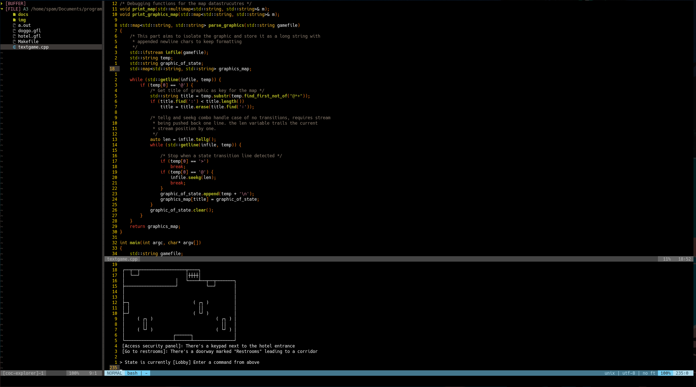
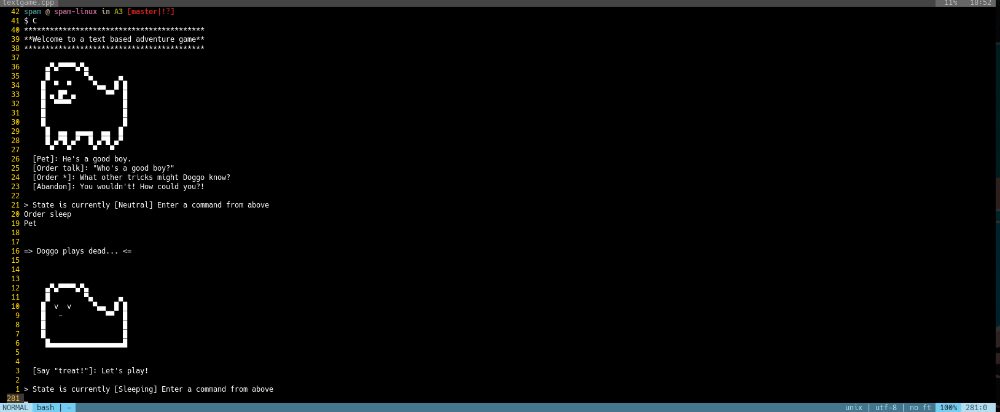
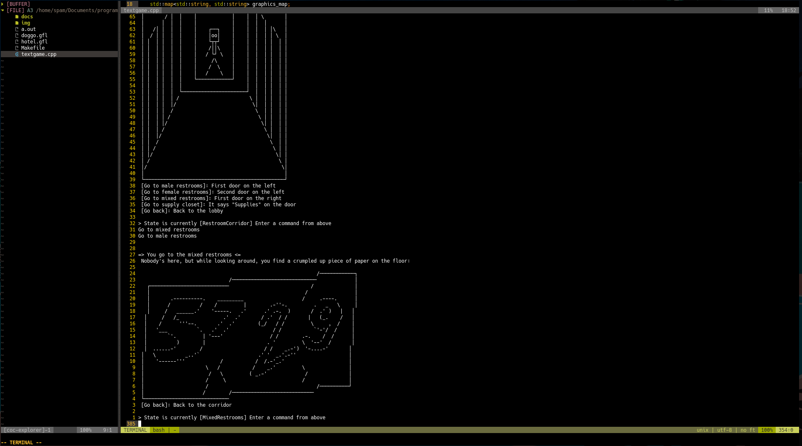

# A3: Text Based Adventure Game 

## Programming Languages and Paradigms Seminar

### Approach

For this assignment I took a second shot at the parser and had a much better time compared to the last FSM assignment. I relied on a lot of the same functions but was able to approach the problems with more pre knowledge and was better able to tackle the task. It still felt very fiddly to deal with reading the files line by line and I even had to do some string stream resetting to parse edge cases like graphics with no further transitions. I decided to use a combinations of `STL` datastrucutres `map` and `multimap` to store the parsed information for retrieval during the game loop. Perhaps a cleaner approach would have been to use a map of a map but unfortunately I didn't find the time to explore this possibility. Being able to set secondary keys would also be nice. 

### Running the program

Navigate to the directory and run the `make` command. This will produce a
binary executable for you to run like `./a.out`. The program will take a file name
to a `.gfl` file as a command line arg. If a file is not provided it will default to
`doggo.gfl`. 

### Deleting the program

You may use the `make clean` command to delete the produced binary.

### Screenshots

